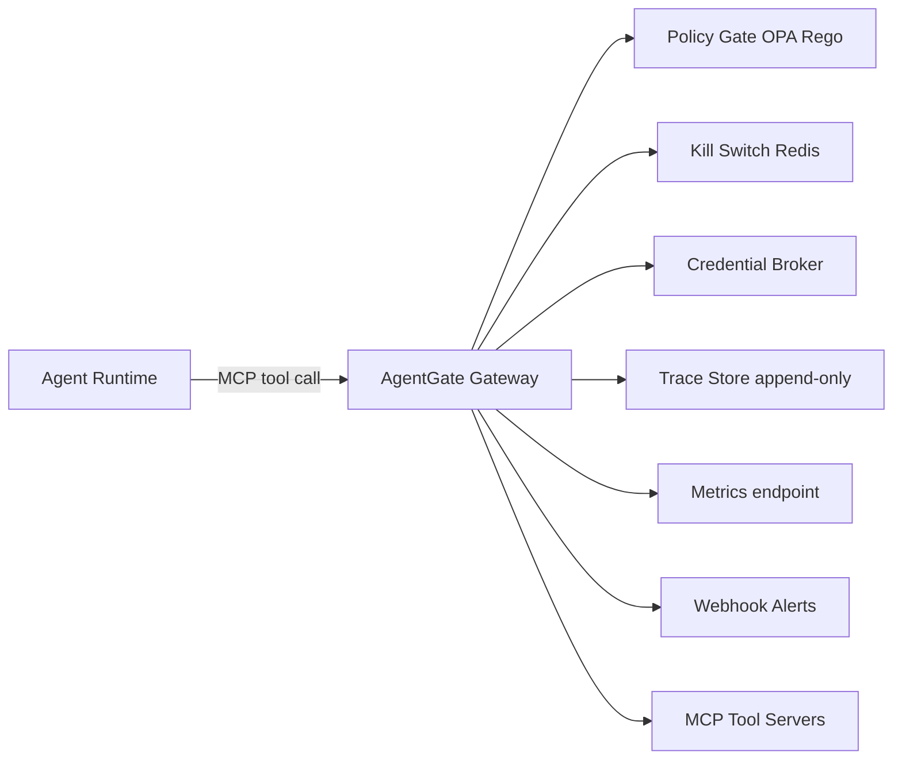

# AgentGate

[](https://github.com/jlov7/agentgate/actions)
[](https://github.com/jlov7/agentgate/actions/workflows/codeql.yml)
[](https://securityscorecards.dev/viewer/?uri=github.com/jlov7/agentgate)
[](https://jlov7.github.io/agentgate/)
[](https://www.python.org/downloads/)
[](docs/assets/mutation-score.svg)
[](LICENSE)
[](https://jlov7.github.io/agentgate/DOCS_HUB/)

**AgentGate** is a containment-first security gateway for AI agents using MCP (Model Context Protocol) tools. It sits between agents and tools, enforces policy-as-code on every call, and produces evidence-grade audit trails.

```
   _                    _    ____       _
  / \   __ _  ___ _ __ | |_ / ___| __ _| |_ ___
 / _ \ / _` |/ _ \ '_ \| __| |  _ / _` | __/ _ \
/ ___ \ (_| |  __/ | | | |_| |_| | (_| | ||  __/
/_/  \_\__, |\___|_| |_|\__|\____|\__,_|\__\___|
       |___/        Containment-First Security
```

> **Note:** This is a personal, independent R&D project. See [INDEPENDENCE.md](INDEPENDENCE.md) for details. This is a reference implementation—not production-ready.

---

## 📚 New Here?

**For a non-technical introduction**, read **[Understanding AgentGate](docs/UNDERSTANDING_AGENTGATE.md)** — a plain-language guide that explains what AgentGate is, why it matters, and how it works. No technical background required.

**For execs and stakeholders**, read **[Executive Summary](docs/EXEC_SUMMARY.md)** — a one-page brief with positioning, differentiators, and the 60-second proof path.

**For a 5-minute hands-on trial**, use **[Try in 5 Minutes](docs/TRY_NOW.md)** and run `make try`.

**For a hosted interactive scenario replay**, open **[Interactive Demo Lab](docs/DEMO_LAB.md)**.

**For a 60-second live demo**, use **[Demo Script](docs/DEMO_SCRIPT.md)**.

**For the docs site**, visit **https://jlov7.github.io/agentgate/**.

**For technical details**, continue reading this README.

---

## 1-Minute Tour

1) Run `make try` to launch the local stack, execute the showcase, and build a proof bundle.
2) Open `docs/showcase/showcase.log` for the narrated policy decisions.
3) Open `docs/showcase/evidence.html` to review the audit-ready report.
4) Open `docs/showcase/metrics.prom` to see live Prometheus counters.
5) Share `docs/showcase/proof-bundle-*.zip` with stakeholders.

---

## What This Is / Isn't

**This is:**
- A containment-first gateway for MCP tool calls with real-time policy enforcement.
- An evidence engine that produces signed JSON/HTML/PDF audit packs.
- A reference implementation you can integrate into agent runtimes.

**This isn’t:**
- A model, agent framework, or autonomous system by itself.
- A turnkey production product (see the R&D note above).

---

## The Problem

Most platforms can **observe** what agents do, but few can **stop** them in real time.

Per the Kiteworks 2026 Data Security Forecast:
- 100% of organizations have agentic AI on their roadmap
- 63% cannot enforce purpose limitations on AI agents
- 60% cannot terminate misbehaving agents in real-time

This 15-20 point gap between monitoring and acting is the defining security challenge for 2026.

## The Solution: Containment-First Security

AgentGate implements a containment-first model with four control layers:

| Layer | Capability | Implementation |
|-------|------------|----------------|
| **Policy Gates** | ALLOW / DENY / REQUIRE_APPROVAL | OPA/Rego policies evaluated on every call |
| **Kill Switches** | Session / Tool / Global termination | Redis-backed real-time state |
| **Credential Broker** | Time-bound, scope-limited access | Stub pattern (integrate with Vault, etc.) |
| **Evidence Export** | Audit-ready JSON, HTML, PDF reports | Append-only SQLite trace store with cryptographic signing |

**Current release:** v0.2.1 (patch: docs/example version alignment)

### What's New in v0.2.x

- **Prometheus Metrics** — Full observability at `/metrics`
- **Webhook Notifications** — Real-time alerts for kill switch activations
- **PDF Evidence Export** — Audit-ready PDF reports
- **Cryptographic Signing** — HMAC signatures on evidence packs
- **Rate Limit Headers** — `X-RateLimit-*` headers on responses
- **Policy Hot-Reload** — Update policies without restart
- **Interactive CLI** — `python -m agentgate --demo`
- **Production Docker** — Hardened container configuration
- **SBOM Generation** — CycloneDX bill of materials

See [NIST AI RMF](https://nvlpubs.nist.gov/nistpubs/ai/NIST.AI.100-1.pdf) for related guidance.

---

## Architecture

```
┌─────────────────────────────────────────────────────────────────┐
│                      AGENT RUNTIME                               │
│  (LangGraph, CrewAI, Strands, custom, etc.)                     │
└─────────────────────────┬───────────────────────────────────────┘
                          │ MCP tool calls
                          ▼
┌─────────────────────────────────────────────────────────────────┐
│                       AGENTGATE                                  │
│  ┌─────────────┐  ┌─────────────┐  ┌─────────────────────────┐ │
│  │ Policy Gate │  │ Kill Switch │  │ Credential Broker       │ │
│  │ (OPA/Rego)  │  │ (Redis)     │  │ (time-bound tokens)     │ │
│  └──────┬──────┘  └──────┬──────┘  └───────────┬─────────────┘ │
│         └────────────────┼─────────────────────┘               │
│                          ▼                                      │
│  ┌─────────────────────────────────────────────────────────┐   │
│  │                 Gateway Core (FastAPI)                   │   │
│  │  • Request validation    • Rate limiting                 │   │
│  │  • Policy evaluation     • Evidence generation           │   │
│  └─────────────────────────────────────────────────────────┘   │
│                          │                                      │
│                          ▼                                      │
│  ┌─────────────────────────────────────────────────────────┐   │
│  │              Trace Store (SQLite, append-only)           │   │
│  └─────────────────────────────────────────────────────────┘   │
└─────────────────────────┬───────────────────────────────────────┘
                          │ Proxied MCP calls
                          ▼
┌─────────────────────────────────────────────────────────────────┐
│                    MCP TOOL SERVERS                              │
└─────────────────────────────────────────────────────────────────┘
```

### Architecture (Mermaid)



See `docs/ARCHITECTURE.md` for the policy decision sequence and slide-ready SVGs.

---

## Quickstart

**Prerequisites:** Python 3.12+, Docker, Docker Compose

```bash
# Clone and enter the repository
git clone https://github.com/jlov7/agentgate.git
cd agentgate

# Create virtual environment and install dependencies
make setup

# Fastest trial path (starts stack, runs showcase, emits proof bundle)
make try
```

Manual runtime path:

```bash
make dev
```

The gateway will be available at `http://localhost:8000`.

**Health check:**
```bash
curl http://localhost:8000/health
# {"status":"ok","version":"0.2.1","opa":true,"redis":true}
```

**First-run self-check (recommended):**
```bash
python -m agentgate --self-check
```

For machine-readable output:
```bash
python -m agentgate --self-check --self-check-json
```

---

## Showcase (60 Seconds)

Run the narrated showcase and generate stakeholder-ready artifacts in `docs/showcase/`:

```bash
make try
```

Then open:
- `docs/showcase/evidence.html` (audit-ready evidence pack)
- `docs/showcase/metrics.prom` (Prometheus snapshot)
- `docs/showcase/showcase.log` (narrated terminal run)
- `docs/showcase/proof-bundle-*.zip` (shareable proof bundle)

---

## UX Snapshots


---

## API Reference

### Core Endpoints

| Endpoint | Method | Description |
|----------|--------|-------------|
| `/tools/call` | POST | Evaluate policy and execute a tool call |
| `/tools/list` | GET | List tools allowed by policy |
| `/sessions` | GET | List active sessions |
| `/sessions/{id}/kill` | POST | Terminate a session immediately |
| `/sessions/{id}/evidence` | GET | Export evidence pack (JSON, HTML, or PDF) |
| `/tools/{name}/kill` | POST | Disable a tool globally |
| `/system/pause` | POST | Pause all tool calls (global kill) |
| `/system/resume` | POST | Resume after global pause |

### Observability & Admin

| Endpoint | Method | Description |
|----------|--------|-------------|
| `/health` | GET | Health check with dependency status |
| `/metrics` | GET | Prometheus metrics |
| `/docs` | GET | Interactive OpenAPI documentation |
| `/redoc` | GET | ReDoc API documentation |
| `/admin/policies/reload` | POST | Hot-reload policies (requires X-API-Key) |
| `/admin/replay/runs` | POST | Run policy replay (requires X-API-Key) |
| `/admin/replay/runs/{run_id}` | GET | Fetch replay run summary (requires X-API-Key) |
| `/admin/replay/runs/{run_id}/report` | GET | Fetch replay deltas report (requires X-API-Key) |
| `/admin/incidents/{incident_id}` | GET | Fetch quarantine incident timeline (requires X-API-Key) |
| `/admin/incidents/{incident_id}/release` | POST | Release quarantined incident (requires X-API-Key) |
| `/admin/tenants/{tenant_id}/rollouts` | POST | Start tenant rollout (requires X-API-Key) |
| `/admin/tenants/{tenant_id}/rollouts/{rollout_id}` | GET | Fetch rollout status (requires X-API-Key) |
| `/admin/tenants/{tenant_id}/rollouts/{rollout_id}/rollback` | POST | Roll back rollout (requires X-API-Key) |

### Example: Tool Call

```bash
curl -X POST http://localhost:8000/tools/call \
  -H 'Content-Type: application/json' \
  -d '{
    "session_id": "demo",
    "tool_name": "db_query",
    "arguments": {"query": "SELECT * FROM products LIMIT 5"}
  }'
```

**Response (allowed):**
```json
{
  "success": true,
  "result": {"rows": [{"id": 1, "name": "Widget"}]},
  "trace_id": "evt-abc123"
}
```

**Response (denied):**
```json
{
  "success": false,
  "error": "Policy denied: Tool not in allowlist",
  "trace_id": "evt-xyz789"
}
```

### Example: Evidence Export

```bash
curl http://localhost:8000/sessions/demo/evidence
```

Sample outputs: [`examples/sample_evidence.json`](examples/sample_evidence.json), [`examples/sample_evidence.html`](examples/sample_evidence.html)

---

## Demo

### Showcase Demo

```bash
# One-command local trial with showcase + proof bundle
make try
```

### Interactive Demo

```bash
# Start the server first
make dev

# In another terminal, run the interactive demo
python -m agentgate --demo
```

### Scripted Demo

```bash
make demo
```

The demo exercises:
1. **Allowed read** — `db_query` succeeds
2. **Denied unknown tool** — `hack_the_planet` blocked
3. **Write requires approval** — `db_insert` returns REQUIRE_APPROVAL
4. **Write with approval** — `db_insert` succeeds with token
5. **Kill switch** — Session terminated, subsequent calls blocked
6. **Evidence export** — Full audit trail generated

To capture terminal output: `bash demo/record_demo.sh`

### Python SDK Usage

```python
import asyncio

from agentgate.client import AgentGateAPIError, AgentGateClient


async def run() -> None:
    client = AgentGateClient.from_env()  # AGENTGATE_URL + optional admin env vars
    try:
        health = await client.health()
        print("health:", health["status"])

        tool_result = await client.call_tool(
            session_id="sdk-demo",
            tool_name="db_query",
            arguments={"query": "SELECT 1"},
            context={"tenant_id": "tenant-a"},
        )
        print("tool call:", tool_result["success"])

        # Admin API methods use client api_key or per-call override.
        exception = await client.create_policy_exception(
            tool_name="db_insert",
            reason="temporary incident response",
            expires_in_seconds=120,
            session_id="sdk-demo",
            created_by="ops-user",
        )
        print("exception:", exception["status"])
    except AgentGateAPIError as exc:
        print(exc.status_code, exc.payload)
    finally:
        await client.close()


asyncio.run(run())
```

### TypeScript SDK Usage

```ts
import { AgentGateApiError, AgentGateClient } from "@agentgate/sdk";

const client = AgentGateClient.fromEnv(); // AGENTGATE_URL + optional admin env vars

try {
  const health = await client.health();
  console.log("health:", health.status);

  const result = await client.callTool({
    sessionId: "sdk-demo",
    toolName: "db_query",
    arguments: { query: "SELECT 1" },
  });
  console.log("tool success:", result.success);
} catch (error) {
  if (error instanceof AgentGateApiError) {
    console.error(error.statusCode, error.payload);
  }
}
```

### CLI Usage

```bash
# Start the server
python -m agentgate

# Start with custom host/port
python -m agentgate --host 0.0.0.0 --port 9000

# Run interactive demo
python -m agentgate --demo

# Run narrated showcase and generate artifacts
python -m agentgate --showcase

# Trigger a replay run with JSON payload
python -m agentgate --replay-run replay.json --admin-key "$AGENTGATE_ADMIN_API_KEY"

# Release a quarantined incident
python -m agentgate --incident-release incident-123 --released-by ops --admin-key "$AGENTGATE_ADMIN_API_KEY"

# Start a tenant rollout with signed package payload
python -m agentgate --rollout-start tenant-a --rollout-payload rollout.json --admin-key "$AGENTGATE_ADMIN_API_KEY"

# Show version
python -m agentgate --version
```

---

## Testing

See `TESTING.md` for full setup, environment requirements, and verification details.
QA Autopilot skill (Codex): `qa-autopilot.skill` is published with the v0.2.1 release assets: https://github.com/jlov7/agentgate/releases/download/v0.2.1/qa-autopilot.skill

```bash
# Full QA run
make verify

# Strict QA run (includes mutation testing + 100% mutation score)
make verify-strict
```

Common testing commands:

```bash
# Lint + typecheck
make lint

# Unit tests with coverage
make unit

# Adversarial security tests
make test-adversarial

# Integration tests (API + live stack)
make integration

# Eval tests and AI evaluation harness
make evals
make ai-evals

# Playwright E2E tests
make e2e

# Mutation testing (optional/nightly)
make mutate

# Lightweight load smoke test (requires running server)
make load-smoke

# Load test with thresholds (k6, starts local server)
make load-test

# Coverage report
make coverage
```

### Security Scanning

```bash
# Generate SBOM (Software Bill of Materials)
make sbom

# Run pip-audit for vulnerability scanning
make audit

# Run all pre-commit hooks
make pre-commit
```

---

## Configuration

### Core Settings

| Variable | Default | Description |
|----------|---------|-------------|
| `AGENTGATE_POLICY_PATH` | `./policies` | Path to Rego policies directory |
| `AGENTGATE_TRACE_DB` | `./traces.db` | SQLite database path |
| `AGENTGATE_REDIS_URL` | `redis://localhost:6379/0` | Redis connection URL |
| `AGENTGATE_OPA_URL` | `http://localhost:8181` | OPA server URL |
| `AGENTGATE_LOG_LEVEL` | `INFO` | Log level (DEBUG, INFO, WARNING, ERROR) |
| `AGENTGATE_POLICY_VERSION` | `v0` | Policy version label for audit |
| `AGENTGATE_APPROVAL_TOKEN` | `approved` | Token for write operation approval |
| `AGENTGATE_RATE_WINDOW_SECONDS` | `60` | Rate limit window in seconds |

### Security Settings

| Variable | Default | Description |
|----------|---------|-------------|
| `AGENTGATE_ADMIN_API_KEY` | `admin-secret-change-me` | Admin API key for privileged endpoints |
| `AGENTGATE_SIGNING_KEY` | *(none)* | HMAC key for evidence signing |
| `AGENTGATE_POLICY_PACKAGE_SECRET` | *(none)* | HMAC key for signed policy package verification |

### Webhook Settings

| Variable | Default | Description |
|----------|---------|-------------|
| `AGENTGATE_WEBHOOK_URL` | *(none)* | URL for webhook notifications |
| `AGENTGATE_WEBHOOK_SECRET` | *(none)* | Shared secret for webhook HMAC |

### Distributed Tracing Settings

| Variable | Default | Description |
|----------|---------|-------------|
| `AGENTGATE_OTEL_ENABLED` | `false` | Enable OTEL-compatible tracing instrumentation |
| `AGENTGATE_OTEL_SERVICE_NAME` | `agentgate` | Service name for traces |
| `AGENTGATE_OTEL_EXPORTER` | `none` | Export mode: `none`, `console`, `otlp` |
| `AGENTGATE_OTEL_EXPORTER_OTLP_ENDPOINT` | *(none)* | OTLP HTTP endpoint when exporter is `otlp` |

---

## Project Structure

```
agentgate/
├── src/agentgate/          # Core implementation
│   ├── main.py             # FastAPI application
│   ├── gateway.py          # Request handling
│   ├── policy.py           # OPA integration
│   ├── killswitch.py       # Kill switch controller
│   ├── traces.py           # Append-only trace store
│   ├── evidence.py         # Evidence exporter
│   ├── replay.py           # Policy replay evaluator
│   ├── quarantine.py       # Quarantine coordinator
│   ├── rollout.py          # Tenant rollout controller
│   ├── policy_packages.py  # Signed policy package verification
│   └── models.py           # Pydantic models
├── policies/               # OPA/Rego policies
│   ├── default.rego        # Base policy rules
│   └── data.json           # Policy data
├── tests/                  # Test suite
│   ├── adversarial/        # Security tests
│   └── *.py                # Unit tests
├── demo/                   # Demo agent
└── examples/               # Sample outputs
```

---

## Observability

### Prometheus Metrics

AgentGate exposes metrics at `/metrics` in Prometheus format:

```bash
curl http://localhost:8000/metrics
```

Available metrics:
- `agentgate_tool_calls_total` — Counter of tool calls by tool and decision
- `agentgate_request_duration_seconds` — Histogram of request latencies
- `agentgate_kill_switch_activations_total` — Counter of kill switch events
- `agentgate_policy_evaluations_total` — Counter of policy evaluations
- `agentgate_rate_limit_hits_total` — Counter of rate limit denials
- `agentgate_health_status` — Gauge of dependency health (1=healthy, 0=unhealthy)

### Webhook Notifications

Configure webhooks to receive real-time alerts:

```bash
export AGENTGATE_WEBHOOK_URL=https://your-webhook-endpoint
export AGENTGATE_WEBHOOK_SECRET=your-shared-secret
```

Events sent:
- `kill_switch.activated` — Session, tool, or global kill switch triggered
- `policy.denied` — Tool call blocked by policy
- `rate_limit.exceeded` — Rate limit threshold hit
- `health.degraded` / `health.recovered` — Dependency health changes

---

## Docker Deployment

### Development

```bash
docker-compose up -d
```

### Production

The production configuration includes security hardening:

```bash
docker-compose -f docker-compose.prod.yml up -d
```

Production features:
- Read-only root filesystem
- Non-root user (UID 1000)
- Dropped capabilities
- No privilege escalation
- Resource limits (CPU/memory)
- Health checks

## Kubernetes Deployment (Helm)

Use the bundled Helm chart:

```bash
helm upgrade --install agentgate ./deploy/helm/agentgate \
  --namespace agentgate \
  --create-namespace
```

Then port-forward and validate health:

```bash
kubectl port-forward svc/agentgate-agentgate -n agentgate 8000:8000
curl http://127.0.0.1:8000/health
```

Full guide: [Kubernetes Deployment](docs/KUBERNETES_DEPLOYMENT.md)

## Terraform Baseline Module

Provision namespace + Helm release via Terraform:

```bash
cd deploy/terraform/agentgate-baseline
cp terraform.tfvars.example terraform.tfvars
terraform init
terraform plan -out=tfplan
terraform apply tfplan
```

Full guide: [Terraform Deployment](docs/TERRAFORM_DEPLOYMENT.md)

---

## Troubleshooting

### `docker` / `docker compose` not found

Run:
```bash
python -m agentgate --self-check
```
If `docker_cli` or `docker_compose` is `fail`, install Docker Desktop and ensure your shell can run `docker --version`.

### `make dev` starts but `/health` is degraded

- Check Redis/OPA containers: `docker compose ps`
- Check service logs: `docker compose logs -f redis opa`
- Re-run diagnostics: `python -m agentgate --self-check`

### Tool calls return `422 Invalid request`

Use the `/docs` request examples for `/tools/call` and include:
- `session_id`
- `tool_name`
- `arguments`

### Evidence export fails for PDF

Install PDF extras and retry:
```bash
pip install -e ".[pdf]"
```

---

## Support

- Product/runtime issues: open a GitHub issue with:
  - output of `python -m agentgate --self-check --self-check-json`
  - output of `make doctor`
  - output of `make support-bundle` (`artifacts/support-bundle.tar.gz` + `artifacts/support-bundle.json`)
  - relevant log snippet from `artifacts/logs/`
- Security disclosures: follow `SECURITY.md`
- Documentation gaps: open a docs issue and include the exact page/section

---

## Limitations

This is a **reference implementation** for demonstration purposes:

- **Not production-ready** — Use as a starting point, not hardened infrastructure
- **Not compliant** — No FedRAMP, SOC2, HIPAA, or other compliance claims
- **Credential broker is a stub** — Integrate with Vault/Secrets Manager for production
- **Single-node only** — No clustering or horizontal scaling
- **MCP proxy pattern only** — Does not work with non-MCP integrations

---

## Contributing

Contributions welcome! Start with the adversarial test suite if you want to find bugs.

1. Fork the repository
2. Create a feature branch
3. Run `make test && make lint`
4. Submit a pull request

---

## License

[Apache License 2.0](LICENSE)

---

## Disclaimer

This is a personal, independent project. It is not affiliated with any employer and is not intended for commercial use. See [DISCLAIMER.md](DISCLAIMER.md) for full details.

---

## Quick Links

| Resource | Description |
|----------|-------------|
| [Try in 5 Minutes](docs/TRY_NOW.md) | One-command setup, showcase, and proof bundle |
| [Interactive Demo Lab](docs/DEMO_LAB.md) | Hosted scenario replay with blast-radius metrics |
| [Demo Day Playbook](docs/DEMO_DAY.md) | 10-minute stakeholder + technical demo flow |
| [Understanding AgentGate](docs/UNDERSTANDING_AGENTGATE.md) | Non-technical introduction |
| [Executive Summary](docs/EXEC_SUMMARY.md) | One-page stakeholder brief |
| [Demo Script](docs/DEMO_SCRIPT.md) | 60-second live demo |
| [Architecture](docs/ARCHITECTURE.md) | Data flow + policy decision diagrams |
| [Threat Model](docs/THREAT_MODEL.md) | Threats, controls, evidence signals |
| [Kubernetes Deployment](docs/KUBERNETES_DEPLOYMENT.md) | Helm-based cluster deployment and rollback guide |
| [Terraform Deployment](docs/TERRAFORM_DEPLOYMENT.md) | Baseline namespace + Helm release provisioning |
| [Distributed Tracing](docs/OBSERVABILITY_TRACING.md) | OpenTelemetry-compatible tracing setup and validation |
| [Observability Pack](docs/OBSERVABILITY_PACK.md) | Default Grafana dashboard and Prometheus alert pack |
| [Showcase Artifacts](docs/showcase/README.md) | Evidence pack, metrics snapshot, logs |
| [Docs Site](https://jlov7.github.io/agentgate/) | Executive-friendly documentation |
| [API Documentation](http://localhost:8000/docs) | Interactive OpenAPI docs (when running) |
| [Contributing Guide](CONTRIBUTING.md) | How to contribute |
| [Security Policy](SECURITY.md) | Security model and reporting |
| [Changelog](CHANGELOG.md) | Version history |
| [Sample Evidence](examples/sample_evidence.html) | Example audit report |
