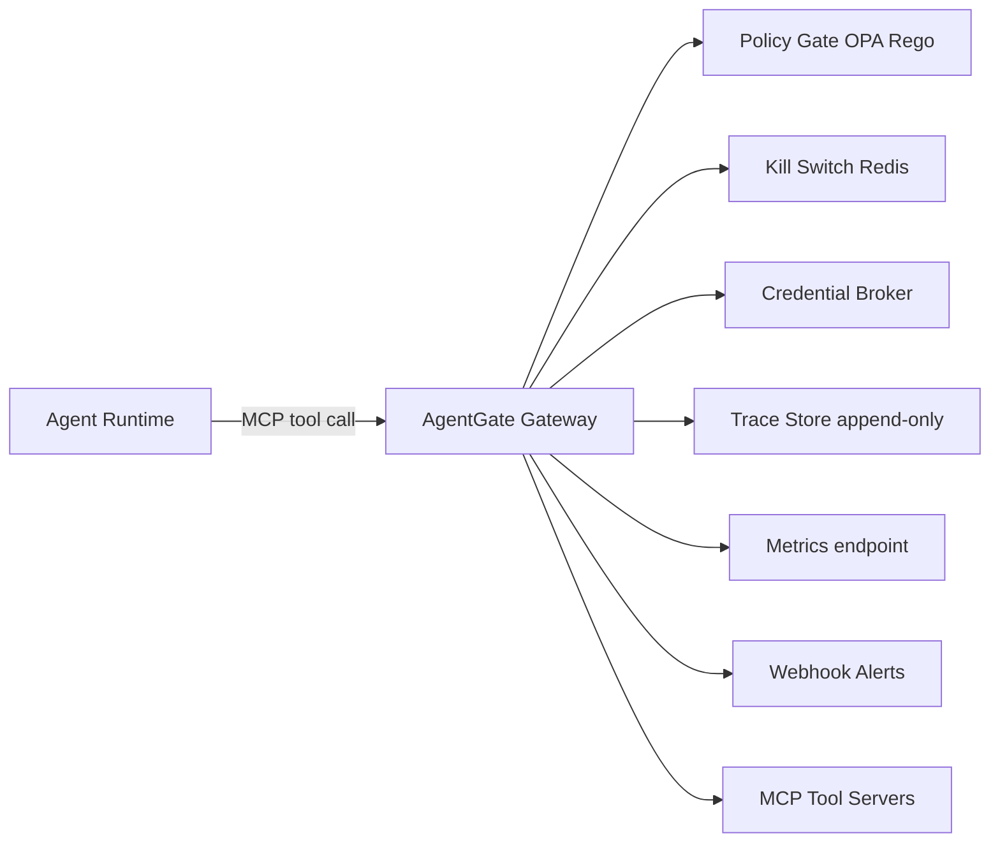
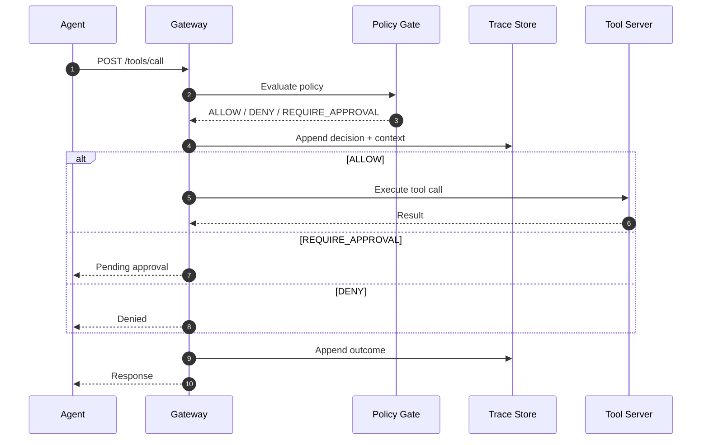

# AgentGate Architecture

## Data Flow

## Policy Decision Sequence

## Slide-Ready Diagrams
- `docs/assets/architecture-flow.svg`
- `docs/assets/policy-sequence.svg`

Regenerate SVGs with `scripts/render_diagrams.sh`.

## Advanced Controls

AgentGate adds three operational control surfaces on top of the core gateway flow:

- **Policy Replay Lab** — replays historical trace events against candidate policies to quantify drift before rollout.
- **Live Quarantine + Revocation** — scores risky outcomes, quarantines sessions, revokes credentials, and records an incident timeline.
- **Signed Tenant Rollouts** — enforces signed policy packages, canary promotion, and rollback on regressions.
