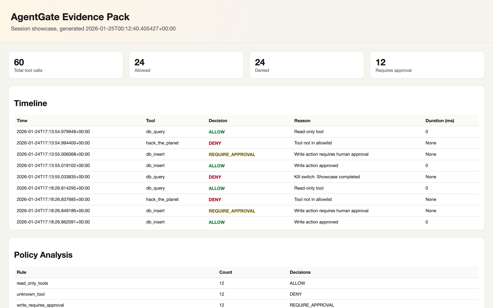
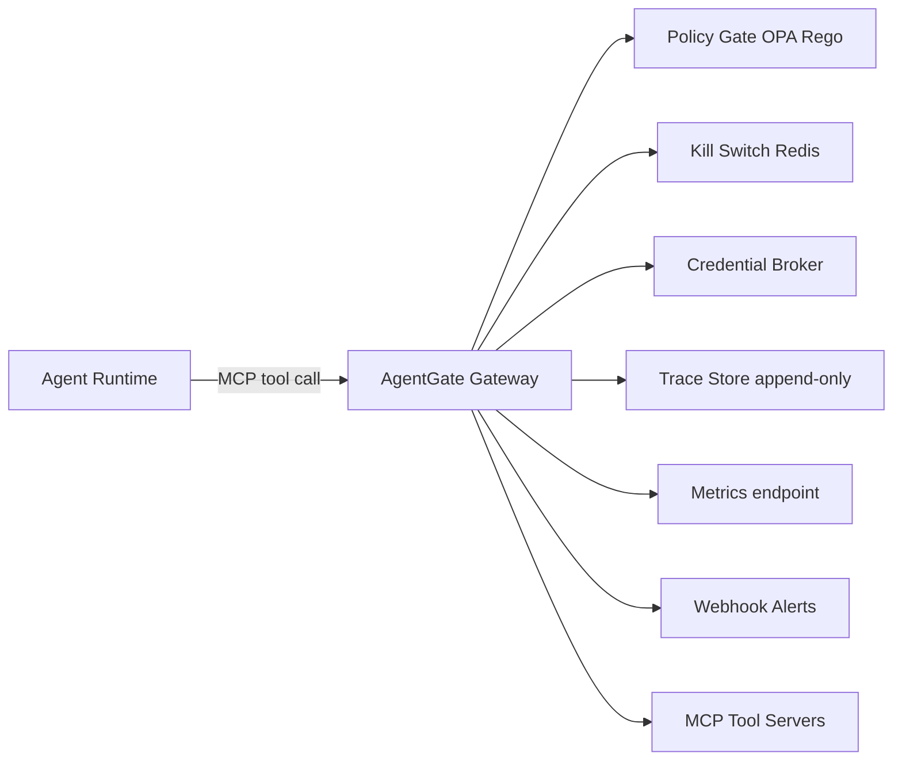

<div class="ag-hero">
  <div class="ag-hero__copy">
    <p class="ag-eyebrow">Containment-first security gateway</p>
    <h1>AgentGate</h1>
    <p class="ag-lede">Stop, approve, and evidence every AI tool call in real time.</p>
    <div class="ag-cta">
      <a class="ag-btn" href="EXEC_SUMMARY/">Executive Summary</a>
      <a class="ag-btn ag-btn--ghost" href="DEMO_SCRIPT/">60-second demo</a>
    </div>
    <div class="ag-kpis">
      <div class="ag-kpi">
        <span class="ag-kpi__label">Decision model</span>
        <strong>ALLOW / DENY / REQUIRE_APPROVAL</strong>
      </div>
      <div class="ag-kpi">
        <span class="ag-kpi__label">Control layers</span>
        <strong>Policy, Kill Switch, Evidence</strong>
      </div>
      <div class="ag-kpi">
        <span class="ag-kpi__label">Outputs</span>
        <strong>JSON, HTML, PDF, Metrics</strong>
      </div>
    </div>
  </div>
  <div class="ag-hero__media">
    
  </div>
</div>

## Why AgentGate
- Most platforms can observe agent behavior; few can block it in real time.
- AI agents need policy enforcement at the tool boundary, not after the fact.
- Audit teams need evidence packs, not screenshots and log fragments.

## Showcase Output
```text
+--------------------------------------------------------------------------------+
| AgentGate Showcase                                                             |
| Containment-first security in 60 seconds                                       |
+--------------------------------------------------------------------------------+

Step 1/9: Health check
Step 3/9: Allowed read (db_query) -> Decision: ALLOW
Step 4/9: Denied unknown tool -> Decision: DENY
Step 5/9: Write without approval -> Decision: REQUIRE_APPROVAL
Step 7/9: Activate kill switch -> Decision: DENY
Step 9/9: Export evidence pack -> evidence.html + metrics.prom
```

Artifacts live in `docs/showcase/`. See `showcase/README.md` for details.

## Architecture Snapshot


## Quickstart
```bash
make setup
make dev
```

## Proof Paths
- Executive overview: `EXEC_SUMMARY.md`
- Live demo: `DEMO_SCRIPT.md`
- Evidence pack: `showcase/evidence.html`
- Metrics snapshot: `showcase/metrics.prom`
