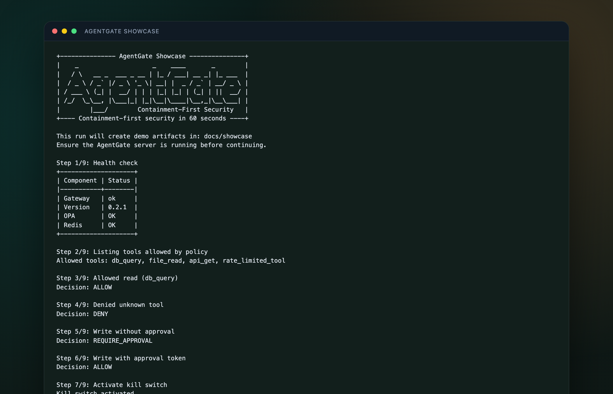

# Frontend Excellence Proof (Showboat)

*2026-02-23T16:00:51Z by Showboat 0.6.1*
<!-- showboat-id: c3e20ff3-4ade-48d4-989e-d80a731ca9bf -->

This report runs the frontend docs gate and summarizes the Playwright JSON report.

```bash
if [ "${SHOWBOAT_REFRESH_GATES:-0}" = "1" ] || [ ! -f artifacts/frontend-gate-report.json ]; then scripts/run_frontend_gate.sh >/dev/null 2>&1; fi; python3 -c 'from pathlib import Path; p = Path("artifacts/frontend-gate-report.json"); print("frontend_gate_report_bytes:", p.stat().st_size)'
```

```output
frontend_gate_report_bytes: 75738
```

```bash
python3 -c 'import json; d = json.load(open("artifacts/frontend-gate-report.json")); s = d.get("stats", {}); print("expected:", s.get("expected")); print("unexpected:", s.get("unexpected")); print("duration_ms:", round(float(s.get("duration", 0)), 2))'
```

```output
expected: 57
unexpected: 0
duration_ms: 17481.37
```


