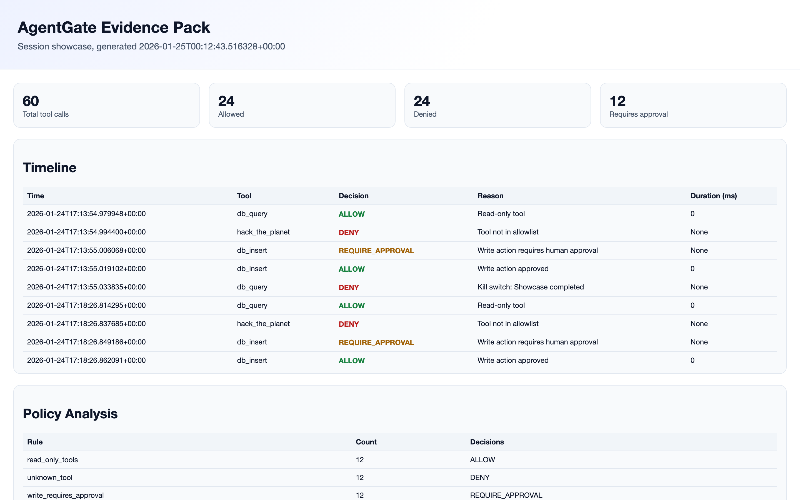

# Release Readiness Proof (Showboat)

*2026-02-23T16:00:51Z by Showboat 0.6.1*
<!-- showboat-id: 1f8071b7-80ef-4e3c-85b0-710b3471f87f -->

This report captures a fresh release-gate run and summarizes the resulting doctor artifact.

```bash
git rev-parse --short HEAD
```

```output
8d6cc8fb
```

```bash
if [ "${SHOWBOAT_REFRESH_GATES:-0}" = "1" ] || [ ! -f artifacts/doctor.json ]; then scripts/doctor.sh >/dev/null 2>&1; fi; python3 -c 'from pathlib import Path; p = Path("artifacts/doctor.json"); print("doctor_json_bytes:", p.stat().st_size)'
```

```output
doctor_json_bytes: 6678
```

```bash
python3 -c 'import json; d = json.load(open("artifacts/doctor.json")); checks = d.get("checks", []); passed = sum(1 for c in checks if c.get("status") == "pass"); print("overall_status:", d.get("overall_status")); print("checks_passed:", f"{passed}/{len(checks)}")'
```

```output
overall_status: pass
checks_passed: 13/13
```


